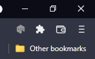
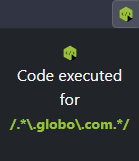
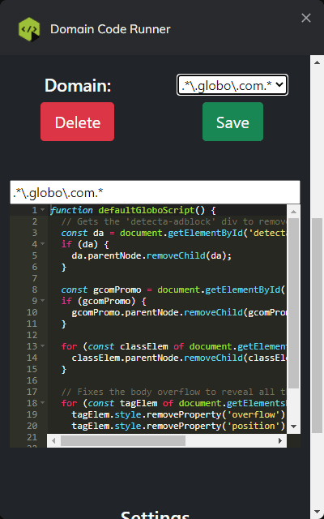

# Domain Code Runner

Runs scripts on certain domains for Chrome and Firefox based browsers.

## Execution

The extension require access to the site location to test if it has some domain associated execution that can run on the current tab. If the location matches one execution rule, the button will be enabled in the extension bar/menu to be clicked and it will run the relative code inside that tab to make whatever the user has commanded to do.

Diabled button has no action:

The enabled button will execute the code when clicked!

## Edit

The user has the option to edit every domain rule and script that is runned inside the associated tab, but it requires an actual knowledge of RegExp and Javasript to do it.

The domain regex will be edited to match each individual tab location, thats when the extension button will be enabled/disabled.

The script function will be a free Javascript code to be executed on the matched tab context. The code must be called when executed or not, that's the users choice.

## Export/Import

Function to export and import configuration files as the extension does not support online save options So any new installation or parallel browser running it has to be synchronized with the option file, manually.
